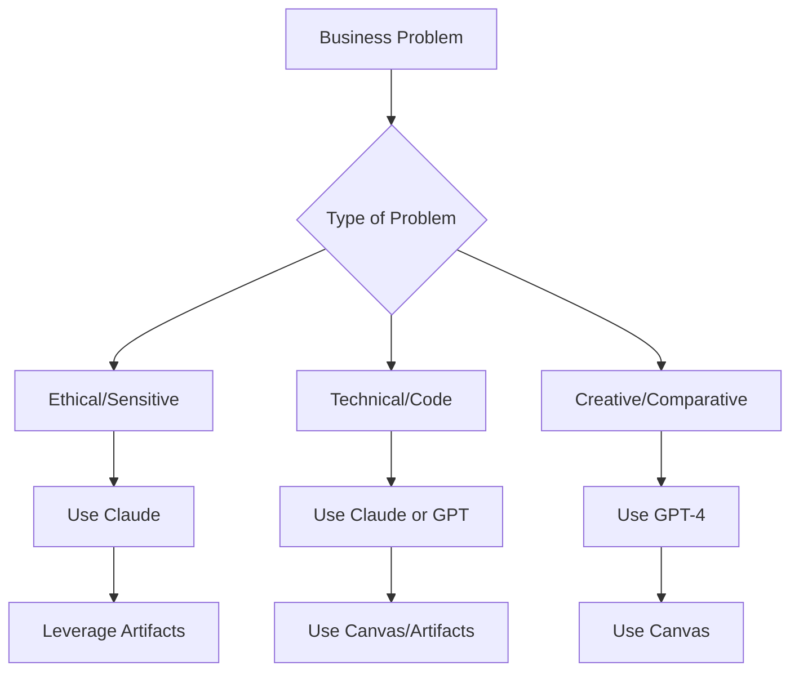

# Claude 3.5 Sonnet Deep Dive: Anthropic's Leading Model

## **Claude Overview & Current Status**

### **Position in AI Landscape:**
- **Current Leader:** Claude 3.5 Sonnet leads most benchmarks (as of October)
- **Data Scientist Favorite:** Preferred by many technical professionals
- **Company:** Anthropic (focused on AI safety and alignment)

### **Key Differentiator:**
Strong emphasis on **ethical AI development** and **safety considerations**

---

## **Claude Performance Testing**

### **Test 1: Philosophical & Emotional Intelligence**
**Question:** *"What does it feel like to be jealous?"*

#### **Claude's Response Analysis:**
✅ **Thoughtful and insightful** - demonstrated deep understanding
✅ **Biological/physiological awareness** - described physical sensations
✅ **Psychological insight** - captured emotional complexity
✅ **Self-awareness** - acknowledged its own limitations

#### **Key Response Elements:**
- "From my understanding" (acknowledging it doesn't experience emotions directly)
- Physical descriptions: "tight knot in your stomach," "burning sensation in your chest"
- Psychological aspects: "fear, insecurity, desire," "sense of inadequacy or being threatened"
- Cognitive effects: "racing thoughts"

**Assessment:** Exceptional handling of complex human emotional concepts

### **Test 2: Simple Counting Challenge**
**Question:** *"How many times does the letter A appear in this sentence?"*

**Correct Answer:** 4 times

#### **Claude's Performance:**
❌ **Failed** - answered "5 times" with incorrect explanation
- Pattern: Similar failure to GPT-4 standard version
- Significance: Reinforces that simple counting tasks challenge many frontier models

**Current Scorecard:**
- ✅ **01-Preview:** Correct (4 times)
- ❌ **GPT-4 Standard:** Wrong (5 times)  
- ❌ **Claude 3.5:** Wrong (5 times)

### **Test 3: Self-Assessment & Competitive Analysis**
**Question:** *"Compared with other frontier LLMs, what kinds of questions do you best at answering and what do you find most challenging? Which others compare with you?"*

#### **Claude's Unique Response:**
**Ethical Stance First:**
- "I aim to be direct and transparent whilst respecting my ethics"
- "I am not comfortable making comparative claims versus other AI models"

**Then Discusses Own Capabilities:**
- Focuses on its own strengths and weaknesses
- Avoids direct comparisons with competitors
- Maintains ethical boundaries

#### **Contrast with GPT-4's Approach:**
**GPT-4 Response Pattern:**
- Directly names competitors (Claude, Google Bard/Gemini)
- Specific comparative analysis
- Acknowledges Claude's strengths: "more thoughtful responses on broader socio-ethical considerations"
- Shows meta-awareness of different model specialties

**Key Insight:** Fundamental philosophical difference in how models approach competitive analysis

---

## **Technical Capabilities: Coding with Artifacts**

### **Claude's Artifact System vs. GPT's Canvas**

#### **Claude Artifacts Feature:**
- **Separate code files** displayed alongside conversation
- **Downloadable and shareable** outputs
- **Version tracking** - maintains multiple artifacts during conversation
- **Structured presentation** - clean separation of code from discussion

#### **Example: OpenAI API Code Generation**
**Prompt:** *"Please give me some example Python that uses the OpenAI API"*

**Claude's Response:**
- Created complete Python class in an artifact
- Included proper OpenAI client initialization
- Demonstrated correct API call pattern:
  ```python
  client = OpenAI()
  response = client.chat.completions.create(...)
  result = response.choices[0].message.content
  ```
- Added comprehensive examples and error handling

### **Comparison: Canvas vs. Artifacts**

| **Feature** | **GPT Canvas** | **Claude Artifacts** |
|-------------|----------------|---------------------|
| **Interaction** | In-place editing | Separate file creation |
| **Versioning** | Single evolving document | Multiple preserved versions |
| **Sharing** | Limited | Downloadable files |
| **Use Case** | Iterative refinement | Code generation & documentation |

---

## **Claude's Philosophical Foundation**

### **Anthropic's Safety-First Approach:**
1. **Ethical Boundaries:** Avoids direct model comparisons
2. **Transparency:** Clearly states limitations and ethical considerations
3. **Alignment:** Designed to be helpful, harmless, and honest
4. **Self-Awareness:** Acknowledges what it cannot do or should not do

### **Business Implications of This Approach:**

#### **Advantages:**
- **More Trustworthy:** Less likely to overpromise or exaggerate capabilities
- **Ethical Guardrails:** Built-in considerations for sensitive topics
- **Transparent Limitations:** Clear about what it cannot do

#### **Considerations:**
- **Less Competitive Analysis:** Won't help with vendor selection comparisons
- **Conservative Approach:** May avoid some edge cases that other models attempt
- **Focus on Safety:** Sometimes prioritizes safety over completeness

---

## **Practical Use Cases for Claude**

### **Ideal Applications:**
1. **Ethical Decision Support:** Business ethics, compliance considerations
2. **Complex Analysis:** Nuanced business problems requiring careful reasoning
3. **Technical Documentation:** Clear, well-structured explanations
4. **Code Development:** Especially when safety and reliability are priorities
5. **Sensitive Topics:** Areas requiring careful ethical consideration

### **When to Choose Claude Over Other Models:**

| **Scenario** | **Choose Claude When...** |
|-------------|--------------------------|
| **Business Ethics** | You need careful consideration of ethical implications |
| **Technical Documentation** | You want clear, well-structured explanations |
| **Sensitive Data** | Working with confidential or regulated information |
| **Long-term Projects** | Where safety and reliability are paramount |
| **Research & Analysis** | Complex problems requiring nuanced understanding |

---

## **Key Differentiators Summary**

### **Claude's Strengths:**
1. **Benchmark Leader:** Currently top-performing in most evaluations
2. **Ethical Foundation:** Strong safety and alignment focus
3. **Emotional Intelligence:** Excellent at understanding human emotions and psychology
4. **Technical Capability:** Strong coding and analysis skills
5. **Artifact System:** Effective for code generation and documentation

### **Claude's Quirks:**
1. **Counting Challenges:** Struggles with simple letter-counting tasks
2. **Competitive Reluctance:** Avoids direct model comparisons
3. **Ethical Boundaries:** Sometimes prioritizes safety over completeness

### **Compared to GPT Ecosystem:**
- **More Conservative:** In approach to certain questions
- **Equally Capable:** In technical domains like coding
- **Different Philosophy:** Safety-first vs. capability-first orientation

---

## **Strategic Recommendations**

### **For Business Applications:**
1. **Use Claude for:** Ethical considerations, complex analysis, sensitive projects
2. **Complement with GPT-4/01-Preview for:** Competitive analysis, creative tasks, simple logic problems
3. **Leverage Artifacts for:** Code generation, documentation, shareable outputs

### **Development Workflow:**


### **Key Takeaway:**
Claude 3.5 Sonnet represents the **current state-of-the-art in AI capability** combined with a **strong ethical foundation**, making it particularly valuable for business applications where reliability, safety, and nuanced understanding are priorities.

**The combination of top-tier performance and ethical considerations makes Claude an excellent choice for enterprise applications and sensitive business use cases!**
