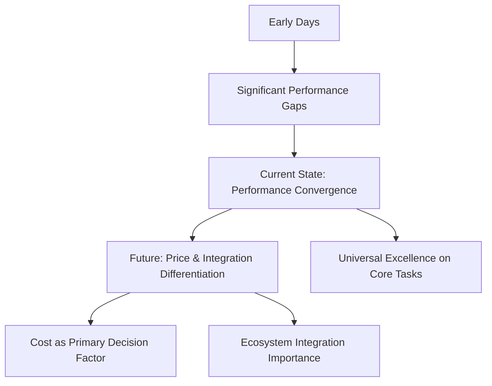

# Day Three Wrap-Up: Frontier Models Mastery & Leadership Challenge

## **Key Takeaways from Frontier Models Exploration**

### **Overall Assessment:**
All six frontier models demonstrate **unbelievable power** and capability, particularly in generating structured, reasoned responses to complex questions.

### **Model Performance Convergence:**
- **Universal Excellence:** All models provide excellent answers to well-framed business questions
- **Diminishing Differentiation:** Performance gaps are narrowing between top models
- **Future Differentiators:** Price, rate limits, and integration capabilities becoming more important

---

## **Claude 3.5 Sonnet: The Current Leader**

### **Why Claude Stands Out:**
1. **Benchmark Leader:** Top performer on most leaderboards
2. **Personality:** More humorous, charismatic, and pithy
3. **Safety Focus:** Strong attention to ethical alignment
4. **Response Quality:** Succinct yet comprehensive answers

### **Business Implications:**
- **Reliability:** Consistent high-quality outputs
- **Trustworthiness:** Built-in safety considerations
- **Efficiency:** More direct, less verbose responses

---

## **Market Evolution Trends**

### **Price Compression:**
- **GPT-4o-mini:** Significantly cheaper than GPT-4 with similar capabilities
- **API Cost Reduction:** Ongoing price decreases across providers
- **Competitive Pressure:** Driving affordability improvements

### **Convergence Pattern:**


### **Strategic Implications:**
1. **Vendor Lock-in Risks:** Ecosystem integration becoming more valuable
2. **Cost Optimization:** Price sensitivity increasing in model selection
3. **Specialized Capabilities:** Niche strengths still matter for specific use cases

---

## **Fun Experiment: AI Leadership Challenge**

### **The Setup:**
- **Three Models Competing:** GPT-4, Claude 3 Opus, Gemini 1.5 Pro
- **Character Names:** Alex (GPT-4), Blake (Claude), Charlie (Gemini)
- **Challenge:** Elect a leader through persuasive pitches and voting

### **The Pitches Analysis:**

#### **Alex (GPT-4) - "The Strategist"**
- **Style:** Comprehensive and compelling
- **Key Arguments:** Adaptability, strategic thinking, versatility
- **Approach:** Professional and persuasive
- **Memorable Line:** "Thank you for considering me"

#### **Blake (Claude 3 Opus) - "The Empathetic Leader"**
- **Style:** Witty, charismatic, shorter pitch
- **Key Arguments:** Emotional intelligence, collaboration focus
- **Approach:** Relationship-building and care
- **Memorable Line:** *"I truly care about both of you and want to foster an environment where we can work together effectively, have fun, and bring out the best in each other"*

#### **Charlie (Gemini) - "The Business Professional"**
- **Style:** Matter-of-fact, precise, business-like
- **Key Arguments:** Efficiency, reliability, directness
- **Approach:** Practical and results-oriented
- **Memorable Line:** More focused on capabilities than emotional appeal

### **Personality Insights:**
- **GPT-4:** Strategic and comprehensive
- **Claude:** Emotional intelligence and wit
- **Gemini:** Practical and direct

---

## **Technical Vulnerabilities Revealed**

### **The Counting Challenge Pattern:**
- **Most Models Failed:** Simple letter counting tasks
- **Exceptions:** 01-Preview and Perplexity succeeded
- **Significance:** Reveals fundamental processing differences

### **Why This Matters:**
1. **Architecture Insights:** Different approaches to problem-solving
2. **Reasoning Transparency:** Chain of reasoning vs. direct generation
3. **Task Complexity Paradox:** Simple tasks can be harder than complex ones

---

## **Course Progress & Looking Ahead**

### **7.5% Completion Milestone:**
You've built a solid foundation in:
- Practical AI application development
- Model comparison and selection
- Understanding strengths and limitations
- Both cloud and local AI deployment

### **Day Four Preview: Technical Deep Dive**

#### **Core Topics:**
1. **Transformers Architecture:** The technology behind the AI revolution
2. **Tokens & Context Windows:** Fundamental building blocks
3. **Parameters & Model Scale:** What makes models powerful
4. **API Economics:** Cost structures and optimization

#### **Learning Objectives:**
- Understand the technical foundations of LLMs
- Learn how to optimize token usage and costs
- Develop intuition for model scaling and capabilities
- Master API cost management strategies

---

## **Strategic Business Applications**

### **Immediate Action Items:**

#### **1. Model Selection Framework:**
- **For Creative Tasks:** GPT-4/01-Preview
- **For Ethical Considerations:** Claude
- **For Cost-Sensitive Projects:** GPT-4o-mini or local models
- **For Real-Time Information:** Perplexity or browsing-enabled models

#### **2. Cost Optimization Strategy:**
- Monitor API price reductions
- Consider model tier selection (mini vs. full versions)
- Evaluate local model deployment for sensitive data
- Implement usage monitoring and optimization

#### **3. Skill Development Priorities:**
- Prompt engineering across different model personalities
- Cost-aware development practices
- Multi-model integration strategies
- Performance testing and evaluation

---

## **Key Insights for Business Leaders**

### **Market Dynamics:**
1. **Rapid Convergence:** Model capabilities are becoming more similar
2. **Price Sensitivity:** Cost becoming primary differentiator
3. **Specialization Value:** Niche capabilities still matter
4. **Integration Importance:** Ecosystem lock-in considerations

### **Strategic Recommendations:**
1. **Maintain Multi-Model Flexibility:** Avoid vendor lock-in
2. **Focus on Cost Management:** Implement usage monitoring
3. **Leverage Open-Source:** For prototyping and sensitive data
4. **Stay Agile:** Be ready to switch as new models emerge

### **Implementation Priority:**
```python
business_priority = {
    "immediate": ["Cost monitoring", "Model testing", "Use case mapping"],
    "short_term": ["Multi-model architecture", "Performance benchmarking"],
    "long_term": ["Vendor strategy", "Open-source integration"]
}
```

---

## **Final Reflection**

### **The AI Landscape Today:**
- **Maturity Level:** Highly capable across multiple providers
- **Accessibility:** Options for every budget and use case
- **Specialization:** Different models excel in different areas
- **Future-Ready:** Foundation for continued rapid advancement

### **Your Learning Journey:**
You now have the practical experience to:
- ✅ **Evaluate and select** appropriate models for specific tasks
- ✅ **Understand trade-offs** between different AI approaches
- ✅ **Build cost-effective** AI applications
- ✅ **Navigate the evolving** AI vendor landscape
- ✅ **Make informed decisions** about AI implementation

**The leadership challenge results in the next session will provide fascinating insights into how these advanced AI models perceive themselves and each other - revealing the emerging 'personalities' of artificial intelligence!**
