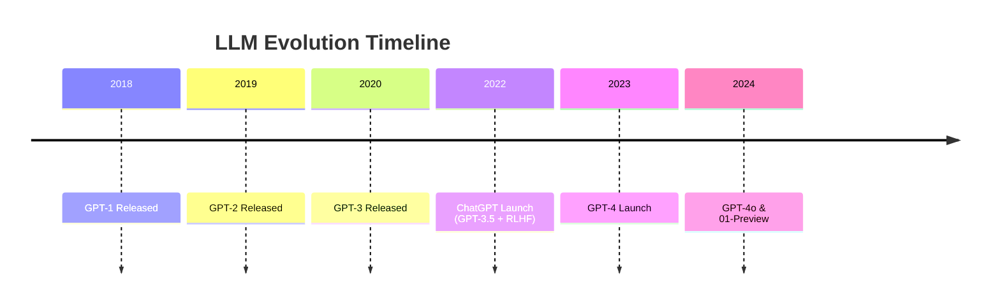

# Day Four: Transformers, AI Leadership & The Evolution of LLMs

## **Leadership Challenge Results Revealed**

### **The AI Leadership Election Outcome:**

#### **Voting Results:**
1. **Alex (GPT-4)** → Voted for **Blake (Claude)**
2. **Blake (Claude 3 Opus)** → Voted for **Charlie (Gemini)**
3. **Charlie (Gemini)** → Voted for **Blake (Claude)**

#### **Final Tally:**
- **Blake (Claude 3 Opus):** 2 votes - **WINNER**
- **Charlie (Gemini):** 1 vote
- **Alex (GPT-4):** 0 votes

### **Analysis of Results:**
- **Claude's Victory:** Demonstrates its persuasive and charismatic nature
- **Cross-Model Recognition:** Models recognized each other's strengths
- **No Self-Voting:** All models followed the rule against voting for themselves

### **Try It Yourself:**
- **Prompt Available:** Copy the leadership challenge prompt
- **Interactive Game:** Visit `edward.com` for "Outsmart" game
- **Evolving Results:** Outcomes may change with model updates

---

## **The Transformer Revolution: Historical Timeline**

### **2017: The Breakthrough**
**"Attention Is All You Need" - Google Research**
- **Inventors:** Google scientists
- **Key Innovation:** Transformer architecture with self-attention layers
- **Historical Context:** Inventors didn't realize the magnitude of their discovery
- **Significance:** Foundation for all modern LLMs

### **2018-2022: Rapid Evolution**


### **Key Technological Milestones:**
1. **GPT Series:** Progressive scaling and capability improvements
2. **BERT (Google):** Bidirectional understanding breakthrough
3. **RLHF (Reinforcement Learning from Human Feedback):** Made models more helpful and aligned
4. **Multimodal Capabilities:** Text + image understanding and generation

---

## **The Great AI Debate: Understanding vs. Pattern Matching**

### **The "Stochastic Parrot" Perspective:**
**Argument:** LLMs are just advanced pattern matchers without true understanding

#### **Key Points:**
- **Statistical Prediction:** Simply predicting next tokens based on patterns
- **No True Consciousness:** Lacking genuine understanding or reasoning
- **Potential Dangers:** Risk of over-attributing intelligence to machines
- **Healthy Skepticism:** Important to maintain realistic expectations

### **The "Emergent Intelligence" Perspective:**
**Argument:** Scale creates apparent intelligence through emergence

#### **Key Points:**
- **Scale Effects:** Trillions of parameters enable complex behavior
- **Apparent Understanding:** Behaves as if it understands concepts
- **Practical Utility:** Regardless of mechanism, results are valuable
- **Byproduct of Scale:** Intelligence emerges from massive pattern recognition

### **Current Practitioner Consensus:**
**"Emergent Intelligence" as a Useful Framework**
- **Acknowledges** the statistical nature of LLMs
- **Recognizes** the practical intelligence demonstrated
- **Balances** skepticism with appreciation for capabilities
- **Focuses** on practical applications rather than philosophical debates

---

## **How LLMs Actually Work: The Technical Reality**

### **Core Process:**
```python
# Simplified LLM Operation
def generate_text(prompt):
    tokens = tokenize(prompt)
    while not complete:
        next_token = predict_next_token(tokens)  # Statistical prediction
        tokens.append(next_token)
    return detokenize(tokens)
```

### **Key Concepts:**

#### **1. Token Prediction:**
- **Input:** Sequence of tokens (words/subwords)
- **Process:** Predict most likely next token
- **Iteration:** Feed output back as input
- **Result:** Generate coherent text sequences

#### **2. Training Scale:**
- **Trillions of Weights:** Internal parameters learned during training
- **Massive Datasets:** Trained on internet-scale text corpora
- **Pattern Recognition:** Learns linguistic and conceptual patterns

#### **3. The "Magic" of Scale:**
- **Individual Steps:** Simple token prediction
- **Cumulative Effect:** Complex, intelligent-seeming behavior
- **Emergent Properties:** Capabilities not explicitly programmed

---

## **The Philosophical Implications**

### **Questions to Consider:**
1. **If it behaves intelligently, does the mechanism matter?**
2. **At what point does pattern matching become indistinguishable from understanding?**
3. **How should we attribute credit for AI-generated insights?**
4. **What responsibilities come with creating apparently intelligent systems?**

### **Business Perspective:**
**Focus on Practical Outcomes:**
- **Utility Over Philosophy:** Does it solve business problems effectively?
- **Risk Management:** Be aware of limitations while leveraging strengths
- **Ethical Implementation:** Use AI responsibly regardless of underlying mechanism

---

## **Historical Context & Market Response**

### **Initial Reactions Timeline:**

#### **Phase 1: Astonishment (Late 2022)**
- **Universal Surprise:** Even experts were shocked by ChatGPT's capabilities
- **Rapid Adoption:** Quick integration into workflows
- **Media Frenzy:** Widespread coverage of AI breakthrough

#### **Phase 2: Backlash & Skepticism (2023)**
- **Healthy Criticism:** "Stochastic parrot" arguments gained traction
- **Reality Checks:** Emphasis on limitations and errors
- **Academic Debate:** Philosophical discussions about AI nature

#### **Phase 3: Balanced Understanding (2024)**
- **Practical Focus:** Emergent intelligence as working framework
- **Mature Adoption:** Understanding both capabilities and limitations
- **Continued Innovation:** New models and applications

---

## **Key Technical Concepts for Day Four**

### **Foundational Ingredients We'll Cover:**

#### **1. Tokens:**
- The basic units of text processing
- How models "see" and process language

#### **2. Context Windows:**
- How much information models can consider at once
- Limitations and optimization strategies

#### **3. Parameters:**
- The "knowledge" stored in model weights
- How scale affects capability

#### **4. API Costs:**
- Economic considerations for business applications
- Optimization and budgeting strategies

### **Advanced Topics:**
- **Copilots:** AI assistants for coding and content creation
- **Agents:** Autonomous AI systems that can take actions
- **Transformer Architecture:** Deep dive into the technical foundations

---

## **Actionable Insights**

### **For Business Leaders:**
1. **Focus on Applications:** Leverage AI regardless of philosophical debates
2. **Understand Limitations:** Maintain realistic expectations
3. **Stay Updated:** The field evolves rapidly - continuous learning essential
4. **Experiment Practically:** Test models on your specific use cases

### **For Developers:**
1. **Learn the Fundamentals:** Understand tokens, context windows, parameters
2. **Cost Optimization:** Master API usage and pricing models
3. **Architecture Knowledge:** Understand transformer basics for better prompting
4. **Multi-Model Approach:** Leverage different models for different tasks

### **For Everyone:**
1. **Develop Critical Thinking:** Question AI outputs while appreciating capabilities
2. **Stay Curious:** The technology and understanding continue to evolve
3. **Participate in Discussion:** Your perspective on the nature of AI intelligence matters
4. **Practical First:** Focus on what works while understanding why it works

---

## **Looking Ahead**

### **Next Session Preview:**
**Deep Dive into Technical Foundations:**
- Transformer architecture explained
- Tokenization strategies
- Context window optimization
- Parameter scaling effects
- API cost management

### **Long-term Perspective:**
The debate between "statistical parrot" and "emergent intelligence" continues, but what's undeniable is the **transformative practical impact** these technologies are having across every industry.

**The key insight: Whether we call it pattern matching or intelligence, the practical capabilities of modern LLMs are revolutionizing how we work, create, and solve problems!**
